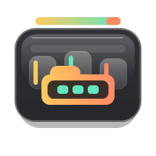

# EdgeFolders

<p align="center">
  
</p>

<p align="center">
  <strong>Красивая верхняя панель-папки для Windows.</strong><br />
  Наведи мышку на верхний край монитора и открой нужные приложения из аккуратных стеклянных блоков.
</p>

<p align="center">
  
  
  
  
</p>

## Что это

EdgeFolders - это легкая Windows-утилита для быстрого запуска приложений, папок, файлов, ярлыков и ссылок. Она живет в трее, не занимает место на рабочем столе и появляется только тогда, когда курсор касается верхнего края экрана.

Идея простая: вместо хаоса из ярлыков и перегруженной панели задач у тебя есть несколько настраиваемых папок. Например: **Быстрое**, **Работа**, **Игры**. Внутри - только иконки, без лишних подписей.

## Быстрый старт

Если нужно просто собрать и запустить приложение из исходников:

1. Установи [.NET 8 SDK](https://dotnet.microsoft.com/download/dotnet/8.0).
2. Открой PowerShell в корне проекта.
3. Собери готовый exe:

```powershell
.\scripts\publish.ps1
```

Если Windows заблокировала запуск PowerShell-скрипта:

```powershell
powershell -ExecutionPolicy Bypass -File .\scripts\publish.ps1
```

4. Запусти приложение:

```powershell
.\publish\win-x64\EdgeFolders.exe
```

После запуска EdgeFolders появится в трее. Наведи мышку на верхний край монитора - сверху выедет панель с папками. Настройки открываются через иконку в трее или через кнопку с шестеренкой на самой панели.

## Возможности

- Появление панели при наведении на верхний край любого монитора.
- Отдельные стеклянные папки с прозрачностью, тенью и плавным fade/hover.
- Центрированная сетка иконок без подписей.
- Ручное изменение размера папок мышкой, размер сохраняется в конфиг.
- Автоматическое перераспределение иконок при расширении или уменьшении папки.
- Drag & drop для `.exe`, `.lnk`, файлов, папок и скриптов.
- Запуск URL и системных URI, например `ms-settings:`.
- Настройки через отдельное окно и меню в трее.
- Поддержка нескольких мониторов с разным разрешением и DPI.
- Per-monitor DPI awareness, чтобы панель не уезжала на соседний экран.
- Кастомная иконка приложения для exe.
- Без Electron и браузерного рантайма: WPF + WinAPI + JSON-конфиг.

## Как выглядит логика


## Сборка готового exe

Готовый exe создается командой:

```powershell
.\scripts\publish.ps1
```

Файл будет здесь:

```text
publish\win-x64\EdgeFolders.exe
```

Сборка self-contained, поэтому на целевой машине не нужно отдельно ставить .NET Runtime.

## Запуск из исходников

Нужно:

- Windows 10 или Windows 11
- .NET 8 SDK

Запуск:

```powershell
.\scripts\run.ps1
```

Или напрямую:

```powershell
dotnet run --project .\src\EdgeFolders\EdgeFolders.csproj --configuration Release
```

## Сборка

```powershell
dotnet build .\EdgeFolders.sln --configuration Release
```

Публикация одного exe:

```powershell
dotnet publish .\src\EdgeFolders\EdgeFolders.csproj `
  --configuration Release `
  --runtime win-x64 `
  --self-contained true `
  -p:PublishSingleFile=true `
  -p:IncludeNativeLibrariesForSelfExtract=true `
  -p:EnableCompressionInSingleFile=true `
  --output .\publish\win-x64
```

## Настройка

EdgeFolders хранит настройки локально:

```text
%APPDATA%\EdgeFolders\config.json
```

Через окно настроек можно:

- создавать и переименовывать папки;
- добавлять приложения, папки, файлы и URL;
- менять порядок папок и элементов;
- включать запуск вместе с Windows;
- настраивать зону наведения и задержку скрытия;
- открывать папку с конфигом.

## Архитектура

```text
src/EdgeFolders
├─ Windows/        # WPF-окна: панель, настройки, редактор элемента
├─ Services/       # конфиг, трей, запуск, иконки, DPI, мониторы
├─ Models/         # JSON-модели папок, элементов и настроек
├─ Controls/       # адаптивная центрированная сетка иконок
├─ Converters/     # иконки файлов и числовые привязки
└─ Assets/         # иконка приложения
```

Ключевые части:

- `EdgeWatcher` следит за верхним краем экрана.
- `MonitorService` получает физические координаты мониторов через WinAPI.
- `OverlayWindow` рисует панель, анимирует папки и зажимает окно внутри активного монитора.
- `ConfigService` сохраняет папки, размеры и элементы в JSON.
- `LaunchService` запускает приложения, папки, URL и команды.

## Проверено

- Release build: без ошибок и предупреждений.
- Publish: self-contained `win-x64`.
- Smoke-тест запуска exe: приложение стартует и не падает.
- Multi-monitor smoke: панель растягивается на всю ширину активного монитора на раскладке `1920x1080 @125%` + `1600x900 @100%`.

## Лицензия

Проект распространяется по лицензии [GPL-3.0](LICENSE).
